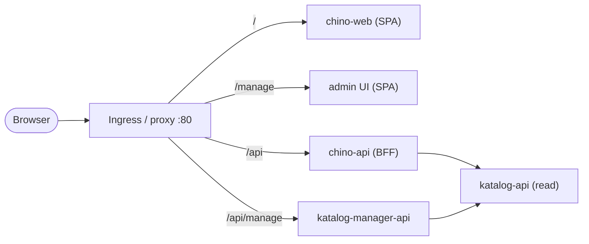

# Zaentrum

**A neutral media client + server for a library you own and are entitled to stream.**
Bring your own files; Zaentrum catalogs, processes, and streams them to clean clients on the
web, your phone/tablet, and your TV.

---

## Try it in one command

```bash
docker run -d --privileged -p 80:80 --name zaentrum ghcr.io/zaentrum/appliance:latest
open http://zaentrum.localhost
```

Then open **http://zaentrum.localhost** — the first-run setup **wizard** guides you through it.
(Modern browsers auto-resolve `*.localhost` to `127.0.0.1`, so this needs **no `/etc/hosts`
edit**.) Sign-in uses the **bundled Keycloak** — log in with its admin account
(`admin` / `dev` by default; you are forced to set a new password on first login).

That single container is the whole product. It runs a full Kubernetes (k3s) **in-process**
alongside the web app, the admin UI, the catalog, transcode/package, and streaming — plus
bundled **Postgres**, **Valkey**, and **Kafka**, so there are no external dependencies to
install. One image, one port, a complete media server.

**Scale out:** the exact same manifests run on any real Kubernetes cluster —
`kubectl apply -k deploy/base`.

---

## First-run flow

On first boot nothing is configured yet, so Zaentrum sends you to the setup wizard at
**`/manage/setup`**. You give it a display name, your OIDC provider details, and the path
to your library; it generates a stream-signing key, persists the config, and from then on
the app opens straight to your catalog.

Under the hood the admin UI calls `GET /api/manage/setup/status`. While that returns
`{"configured": false}`, the app routes every visitor to the wizard. Once you finish setup
it flips to `true` and the wizard step-aside disappears.

---

## Route map

One ingress/proxy fronts everything on port 80:

| Path | Backend | What it is |
|---|---|---|
| `/` | `chino-web` | the main app — a static SPA |
| `/manage` | admin UI (`apps/admin`) | the React launchpad — a SPA with router basename `/manage` |
| `/api` | `chino-api` | the product BFF |
| `/api/manage` | `katalog-manager-api` | the neutral management / write API |



---

## Products

Zaentrum is the platform; the clients are skins over one shared core.

| Component | What it is | State |
|---|---|---|
| **chino** (web · mobile · androidtv) | Video client — the reference product | Real |
| **admin** (`/manage`) | The launchpad: first-run setup + day-2 management | Real |
| **chino-api** / **chino-stream** | Product BFF + HLS/CMAF origin | Real |
| **katalog-manager-api** | Neutral management / write API + first-run backend | Real |
| **katalog-api** + processing (transcoder, packager, enricher, analyzer, artwork) | Neutral catalog core | Real |
| **musig** / **tv** | Music / live clients | Planned — slots reserved |

## Deploy

`deploy/` is the single source of truth.

```bash
# All-in-one appliance — k3s in one container, everything bundled
docker run -d --privileged -p 80:80 --name zaentrum ghcr.io/zaentrum/appliance:latest
# then: open http://zaentrum.localhost

# Scale out — the same manifests on a real cluster
kubectl apply -k deploy/base
```

**Running under a different name** (a LAN host, a public domain, or the box's IP):
the issuer host must equal the host you reach Zaentrum at, so set it in all four places —
`deploy/base/ingress.yaml` host, `zaentrum-env` `OIDC_ISSUER`, `zaentrum-keycloak-config`
`KC_HOSTNAME`, and (on the appliance) the `STUBE_ISSUER_HOST` env var on the container.

## Deploying

**Deployment & operations documentation lives in the front-door repo:
[github.com/zaentrum/zaentrum → `docs/`](https://github.com/zaentrum/zaentrum/tree/main/docs).**
It routes by audience and covers every path (prerequisites, self-hosting, the
operator + `Zaentrum` CR reference, a worked GitOps deploy, day-2 updates, and
troubleshooting). This repo holds the operator, chart, and deploy templates the
docs describe.

## Repository layout

This is the platform **meta-repo**: the operator, the deploy manifests, and the two
platform-owned images that have no repo of their own. The application/service **sources**
live in their own repos at `github.com/zaentrum/<svc>` and publish flat
`ghcr.io/zaentrum/<svc>` images; the manifests here just reference those images.

```
operator/         the controller-manager — reconciles the Zaentrum CR into the deploy set
deploy/           allinone (k3s-in-one) · base (real cluster) · compose · overlays  ← source of truth for deploy
apps/admin/       the /manage admin UI            → ghcr.io/zaentrum/admin     (built here)
platform/keycloak/ bundled identity provider      → ghcr.io/zaentrum/keycloak  (built here)
                  (deployment docs live in the front-door repo: github.com/zaentrum/zaentrum/docs)
```

Service images the manifests pull (each owned by its own `github.com/zaentrum` repo):
`chino-web` · `chino-api` · `chino-stream` · `katalog-api` · `katalog-manager`.

## What is deliberately **not** here

Zaentrum is content-neutral. It catalogs and streams a library you already own; it never
fetches content, and how files arrive on disk is out of scope. There are no built-in
downloaders, no indexer integrations, and no automation that reaches out for media — by
design and forever. See [docs/architecture.md](docs/architecture.md#scope).

## License

[**MPL-2.0**](LICENSE) — file-level copyleft that protects the platform while staying
distributable on mobile app stores (which matters for the iOS client). Rationale in
[docs/architecture.md](docs/architecture.md#license).
