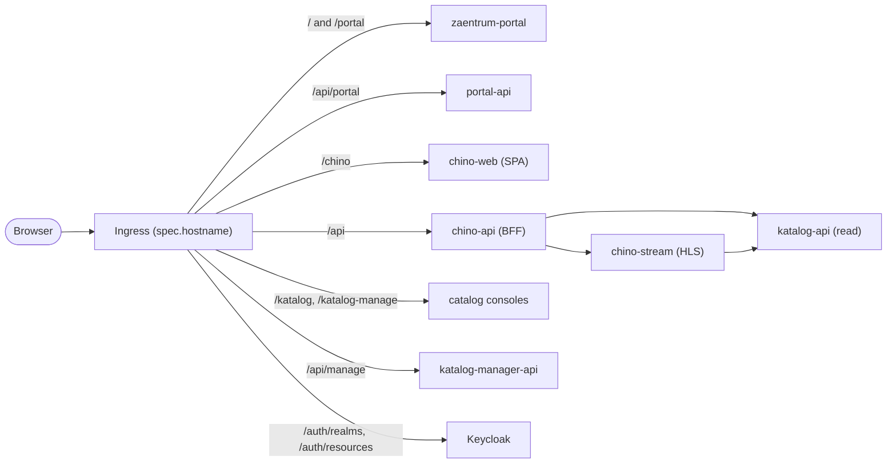

# Zaentrum

**A neutral media client + server for a library you own and are entitled to stream.**
Bring your own files; Zaentrum catalogs, processes, and streams them to clean clients on the
web, your phone/tablet, and your TV.

---

## Try it in one command

```bash
docker run -d --privileged --restart unless-stopped -p 80:80 --name zaentrum \
  ghcr.io/zaentrum/appliance:latest
open http://zaentrum.localhost
```

That single container runs the whole platform: a full Kubernetes (k3s) in-process, the
**operator**, and everything the operator brings up — the portal, the web app, the catalog and
its consoles, streaming, and bundled **Keycloak**, **Postgres**, **Valkey** and **Kafka**. One
image, one port, nothing else to install; the first boot pulls the platform's images from
`ghcr.io` and takes a few minutes.

- **Port 80, and the name `zaentrum.localhost`.** The platform's Ingress answers that host
  only, and its sign-in is bound to `http://zaentrum.localhost` — no other name, no other port.
  Modern browsers resolve `*.localhost` to `127.0.0.1`, so this needs no `/etc/hosts` edit.
- **linux/amd64 only.** No arm64 image is published yet.
- **This machine only.** Phones, TVs and other computers need https — see
  [phones and TVs](#phones-and-tvs).
- **Keep the container.** The library and the database live in its volume, and replacing the
  container starts an empty platform — see [persistence](deploy/allinone/README.md#persistence).

The appliance in detail: [deploy/allinone/README.md](deploy/allinone/README.md).

---

## First run

There is **no setup wizard**: a fresh install comes up configured, with the bundled Keycloak
(realm `zaentrum`) and an empty library. Three steps make it yours
([self-hosting → first run](https://github.com/zaentrum/zaentrum/blob/main/docs/self-hosting.md#first-run)):

1. **Sign in** as `admin` with the first admin password. The operator generates it once per
   install and keeps it in the Secret `zaentrum-keycloak-admin`; Keycloak then has you choose a
   password of your own:

   ```bash
   docker exec zaentrum kubectl -n zaentrum get secret zaentrum-keycloak-admin \
     -o jsonpath='{.data.realm-admin-password}' | base64 -d; echo
   ```

   On a cluster, run the same `kubectl` without `docker exec zaentrum`.
2. **Add a TMDB key** under **Catalog Management → settings** (`/katalog-manage/`) before the
   first scan: titles, posters and plots come from TMDB, and the images carry no key.
3. **Copy your files into the library, then trigger a scan** in Catalog Management. The library
   is the `media/` folder of the platform's `media` volume — on the appliance, a directory
   inside the container ([how to fill it](deploy/allinone/README.md#first-run)).

## Phones and TVs

Sign-in needs **https** everywhere but on the machine itself. Keycloak marks its login cookies
`Secure`, which a browser keeps over plain http for `localhost` names only — over
`http://<lan-ip>` Keycloak answers the login form with "Cookie not found" — and the Android
phone and TV apps refuse plain http altogether and trust public certificate authorities only.
The appliance serves plain http at `zaentrum.localhost`, so it is for the machine it runs on.
For other devices, run the operator on a cluster under a real hostname with TLS
([self-hosting](https://github.com/zaentrum/zaentrum/blob/main/docs/self-hosting.md#b-self-host-with-the-operator),
[troubleshooting](https://github.com/zaentrum/zaentrum/blob/main/docs/troubleshooting.md#8-sign-in-fails-over-plain-http-cookie-not-found)).

## Identity

Zaentrum runs its **own bundled Keycloak** (realm `zaentrum`), or — with
`identity.mode: external` on a cluster — validates the tokens of your own OIDC provider and
renders no Keycloak. Those are the two modes the CRD accepts; federating your provider through
the bundled Keycloak (`broker`,
[ADR-0007](https://github.com/zaentrum/zaentrum/blob/main/docs/adr/0007-identity-modes.md)) is
designed, not built.

Users are managed in Keycloak, whose admin console is **not on the public host**: the Ingress
sends only `/auth/realms` and `/auth/resources` to Keycloak. Reach it through a port-forward on
local port 8080 — the console's links point there — signed in as the bootstrap admin (keys
`username` and `password` of the Secret `zaentrum-keycloak-admin`), then switch to the realm
`zaentrum`:

```bash
kubectl -n zaentrum port-forward svc/keycloak 8080:80
open http://localhost:8080/auth/admin/
```

Or publish it on the public host with `spec.identity.exposeAdminConsole: true`. The details:
[operator/README.md](operator/README.md#the-admin-console); the appliance's variant:
[deploy/allinone/README.md](deploy/allinone/README.md#keycloaks-admin-console).

## Run it on a cluster

The same platform runs on any Kubernetes cluster through the **operator**, which reconciles the
whole stack from a single `Zaentrum` resource. Install it once, as cluster-admin, from its
pinned install manifest — the CRDs, the cluster RBAC and the controller, pinned to one immutable
`operator:sha-<commit>` image — then apply a `Zaentrum`:

```bash
kubectl apply -f https://raw.githubusercontent.com/zaentrum/zaentrum-operator/main/deploy/operator-install.yaml
kubectl create namespace zaentrum
kubectl apply -f zaentrum.yaml     # your Zaentrum resource
kubectl -n zaentrum get zaentrum   # PHASE Ready once it is up
```

On OpenShift or any OLM cluster, the [OLM bundle](operator/bundle) is the alternative; without
the operator, `helm install` the chart it renders,
[`operator/platform/chart`](operator/platform/chart).

`spec.hostname` is the name the platform answers at: the operator derives the OIDC issuer,
Keycloak's `KC_HOSTNAME` and the Ingress host from it. Serve that name over https — TLS
terminated in front of the Ingress, `identity.issuerScheme: https`, and
`network.issuerHostAliasIP` so in-cluster token validation reaches the https issuer. A minimal
resource and every field:
[self-hosting](https://github.com/zaentrum/zaentrum/blob/main/docs/self-hosting.md#b-self-host-with-the-operator),
[operator & CR reference](https://github.com/zaentrum/zaentrum/blob/main/docs/operator.md).

**After every update the platform checks itself** — outside-in through its public
URL, with a real sign-in — and the operator reports the verdict in
`status.verification` (`kubectl get zaentrum`, `zae platform status`). What runs,
when, the test account and how to ask for a run:
[operator/README.md](operator/README.md#the-platform-checks-itself-statusverification).

`deploy/base`, `deploy/compose`, `deploy/k3s` and `deploy/overlays` are older profiles kept in
the tree; they do not bring up a working platform and are not supported
([why](https://github.com/zaentrum/zaentrum/blob/main/docs/self-hosting.md#d-k3s-and-compose-profiles)).

---

## Route map

One Ingress — or, with `routing.provisionRoutes`, OpenShift Routes with the same paths — fronts
everything on the host `spec.hostname` names:

| Path | Backend | What it is |
|---|---|---|
| `/`, `/portal` | `zaentrum-portal` | the portal — the launchpad that opens the apps and, for an admin, the consoles |
| `/api/portal` | `portal-api` | the portal's API |
| `/chino`, `/auth/callback` | `chino-web` | the video app — a static SPA |
| `/api` | `chino-api` | the product BFF |
| `/katalog` | `katalog-manager-ui` | the Catalog console (admin) |
| `/katalog-manage` | `katalog-manage-ui` | Catalog Management — scan and settings (admin) |
| `/api/manage` | `katalog-manager-api` | the neutral management / write API |
| `/auth/realms`, `/auth/resources` | `keycloak` | sign-in (bundled identity); all of `/auth` with `exposeAdminConsole` |


```mermaid
flowchart LR
  user(["Browser"]) --> ing["Ingress (spec.hostname)"]
  ing -- "/ and /portal" --> portal["zaentrum-portal"]
  ing -- "/api/portal" --> papi["portal-api"]
  ing -- "/chino" --> web["chino-web (SPA)"]
  ing -- "/api" --> api["chino-api (BFF)"]
  ing -- "/katalog, /katalog-manage" --> consoles["catalog consoles"]
  ing -- "/api/manage" --> mgr["katalog-manager-api"]
  ing -- "/auth/realms, /auth/resources" --> kc["Keycloak"]
  api --> katalog["katalog-api (read)"]
  api --> stream["chino-stream (HLS)"]
  stream --> katalog
```

---

## Products

Zaentrum is the platform; the clients are skins over one shared core.

| Component | What it is | State |
|---|---|---|
| **chino** (web · mobile · androidtv) | Video client — the reference product | Real |
| **portal** (`zaentrum-portal` + `portal-api`) | The launchpad: the apps, the catalog consoles, the operator console | Real |
| **katalog-manager-ui** (`/katalog`, `/katalog-manage`) | The Catalog and Catalog Management consoles | Real |
| **chino-api** / **chino-stream** | Product BFF + HLS/CMAF origin | Real |
| **katalog-manager-api** | Neutral management / write API | Real |
| **katalog-api** | Neutral catalog read API | Real |
| processing (analyzer, packager, transcoder, katalog-ingest) | The media pipeline — off unless `features.pipeline` | Real |
| **musig** / **tv** | Music / live clients | Planned |

## Documentation

**Deployment & operations documentation lives in the front-door repo:
[github.com/zaentrum/zaentrum → `docs/`](https://github.com/zaentrum/zaentrum/tree/main/docs).**
It routes by audience and covers every path (prerequisites, self-hosting, the
operator + `Zaentrum` CR reference, a worked GitOps deploy, day-2 updates, and
troubleshooting). This repo holds the operator, the chart, and the install bundles
the docs describe.

## Repository layout

This is the platform **meta-repo**: the operator, the deploy manifests, and the two
platform-owned images that have no repo of their own. The application/service **sources**
live in their own repos at `github.com/zaentrum/<svc>` and publish flat
`ghcr.io/zaentrum/<svc>` images; the manifests here just reference those images.

```
operator/         the controller-manager — reconciles the Zaentrum CR into the deploy set
deploy/           allinone (k3s-in-one) · base (real cluster) · compose · overlays  ← source of truth for deploy
apps/admin/       the /manage admin UI            → ghcr.io/zaentrum/admin     (built here)
platform/keycloak/ bundled identity provider      → ghcr.io/zaentrum/keycloak  (built here)
                  (deployment docs live in the front-door repo: github.com/zaentrum/zaentrum/docs)
```

Service images the manifests pull (each owned by its own `github.com/zaentrum` repo):
`chino-web` · `chino-api` · `chino-stream` · `katalog-api` · `katalog-manager`.

## What is deliberately **not** here

Zaentrum is content-neutral. It catalogs and streams a library you already own; it never
fetches content, and how files arrive on disk is out of scope. There are no built-in
downloaders, no indexer integrations, and no automation that reaches out for media — by
design and forever. See [docs/architecture.md](docs/architecture.md#scope).

## License

[**MPL-2.0**](LICENSE) — file-level copyleft that protects the platform while staying
distributable on mobile app stores (which matters for the iOS client). Rationale in
[docs/architecture.md](docs/architecture.md#license).
