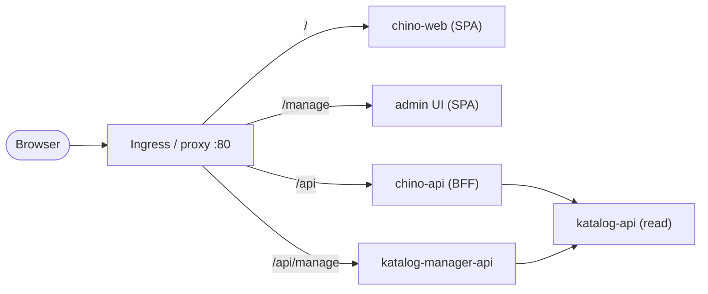

# Zaentrum

**A neutral media client + server for a library you own and are entitled to stream.**
Bring your own files; Zaentrum catalogs, processes, and streams them to clean clients on the
web, your phone/tablet, and your TV.

---

## Try it in one command

```bash
docker run -d --privileged --restart unless-stopped -p 80:80 --name zaentrum \
  ghcr.io/zaentrum/appliance:latest
open http://zaentrum.localhost
```

That single container runs the whole platform: a full Kubernetes (k3s) in-process, the
**operator**, and everything the operator brings up — the portal, the web app, the catalog and
its consoles, streaming, and bundled **Keycloak**, **Postgres**, **Valkey** and **Kafka**. One
image, one port, nothing else to install; the first boot pulls the platform's images from
`ghcr.io` and takes a few minutes.

- **Port 80, and the name `zaentrum.localhost`.** The platform's Ingress answers that host
  only, and its sign-in is bound to `http://zaentrum.localhost` — no other name, no other port.
  Modern browsers resolve `*.localhost` to `127.0.0.1`, so this needs no `/etc/hosts` edit.
- **linux/amd64 only.** No arm64 image is published yet.

The appliance in detail: [deploy/allinone/README.md](deploy/allinone/README.md).

**Scale out:** the exact same manifests run on any real Kubernetes cluster —
`kubectl apply -k deploy/base`.

---

## First run

There is **no setup wizard**: a fresh install comes up configured, with the bundled Keycloak
(realm `zaentrum`) and an empty library. Three steps make it yours
([self-hosting → first run](https://github.com/zaentrum/zaentrum/blob/main/docs/self-hosting.md#first-run)):

1. **Sign in** as `admin` with the first admin password. The operator generates it once per
   install and keeps it in the Secret `zaentrum-keycloak-admin`; Keycloak then has you choose a
   password of your own:

   ```bash
   docker exec zaentrum kubectl -n zaentrum get secret zaentrum-keycloak-admin \
     -o jsonpath='{.data.realm-admin-password}' | base64 -d; echo
   ```

   On a cluster, run the same `kubectl` without `docker exec zaentrum`.
2. **Add a TMDB key** under **Catalog Management → settings** (`/katalog-manage/`) before the
   first scan: titles, posters and plots come from TMDB, and the images carry no key.
3. **Copy your files into the library, then trigger a scan** in Catalog Management. The library
   is the `media/` folder of the platform's `media` volume — on the appliance, a directory
   inside the container ([how to fill it](deploy/allinone/README.md#first-run)).

---

## Route map

One ingress/proxy fronts everything on port 80:

| Path | Backend | What it is |
|---|---|---|
| `/` | `chino-web` | the main app — a static SPA |
| `/manage` | admin UI (`apps/admin`) | the React launchpad — a SPA with router basename `/manage` |
| `/api` | `chino-api` | the product BFF |
| `/api/manage` | `katalog-manager-api` | the neutral management / write API |


```mermaid
flowchart LR
  user(["Browser"]) --> proxy["Ingress / proxy :80"]
  proxy -- "/" --> web["chino-web (SPA)"]
  proxy -- "/manage" --> admin["admin UI (SPA)"]
  proxy -- "/api" --> api["chino-api (BFF)"]
  proxy -- "/api/manage" --> mgr["katalog-manager-api"]
  api --> katalog["katalog-api (read)"]
  mgr --> katalog
```

---

## Products

Zaentrum is the platform; the clients are skins over one shared core.

| Component | What it is | State |
|---|---|---|
| **chino** (web · mobile · androidtv) | Video client — the reference product | Real |
| **admin** (`/manage`) | The launchpad: first-run setup + day-2 management | Real |
| **chino-api** / **chino-stream** | Product BFF + HLS/CMAF origin | Real |
| **katalog-manager-api** | Neutral management / write API + first-run backend | Real |
| **katalog-api** + processing (transcoder, packager, enricher, analyzer, artwork) | Neutral catalog core | Real |
| **musig** / **tv** | Music / live clients | Planned — slots reserved |

## Deploy

`deploy/` is the single source of truth.

```bash
# All-in-one appliance — k3s in one container, everything bundled
docker run -d --privileged -p 80:80 --name zaentrum ghcr.io/zaentrum/appliance:latest
# then: open http://zaentrum.localhost

# Scale out — the same manifests on a real cluster
kubectl apply -k deploy/base
```

**After every update the platform checks itself** — outside-in through its public
URL, with a real sign-in — and the operator reports the verdict in
`status.verification` (`kubectl get zaentrum`, `zae platform status`). What runs,
when, the test account and how to ask for a run:
[operator/README.md](operator/README.md#the-platform-checks-itself-statusverification).

**Running under a different name** (a LAN host, a public domain, or the box's IP):
the issuer host must equal the host you reach Zaentrum at, so set it in all four places —
`deploy/base/ingress.yaml` host, `zaentrum-env` `OIDC_ISSUER`, `zaentrum-keycloak-config`
`KC_HOSTNAME`, and (on the appliance) the `STUBE_ISSUER_HOST` env var on the container.

## Deploying

**Deployment & operations documentation lives in the front-door repo:
[github.com/zaentrum/zaentrum → `docs/`](https://github.com/zaentrum/zaentrum/tree/main/docs).**
It routes by audience and covers every path (prerequisites, self-hosting, the
operator + `Zaentrum` CR reference, a worked GitOps deploy, day-2 updates, and
troubleshooting). This repo holds the operator, chart, and deploy templates the
docs describe.

## Repository layout

This is the platform **meta-repo**: the operator, the deploy manifests, and the two
platform-owned images that have no repo of their own. The application/service **sources**
live in their own repos at `github.com/zaentrum/<svc>` and publish flat
`ghcr.io/zaentrum/<svc>` images; the manifests here just reference those images.

```
operator/         the controller-manager — reconciles the Zaentrum CR into the deploy set
deploy/           allinone (k3s-in-one) · base (real cluster) · compose · overlays  ← source of truth for deploy
apps/admin/       the /manage admin UI            → ghcr.io/zaentrum/admin     (built here)
platform/keycloak/ bundled identity provider      → ghcr.io/zaentrum/keycloak  (built here)
                  (deployment docs live in the front-door repo: github.com/zaentrum/zaentrum/docs)
```

Service images the manifests pull (each owned by its own `github.com/zaentrum` repo):
`chino-web` · `chino-api` · `chino-stream` · `katalog-api` · `katalog-manager`.

## What is deliberately **not** here

Zaentrum is content-neutral. It catalogs and streams a library you already own; it never
fetches content, and how files arrive on disk is out of scope. There are no built-in
downloaders, no indexer integrations, and no automation that reaches out for media — by
design and forever. See [docs/architecture.md](docs/architecture.md#scope).

## License

[**MPL-2.0**](LICENSE) — file-level copyleft that protects the platform while staying
distributable on mobile app stores (which matters for the iOS client). Rationale in
[docs/architecture.md](docs/architecture.md#license).
