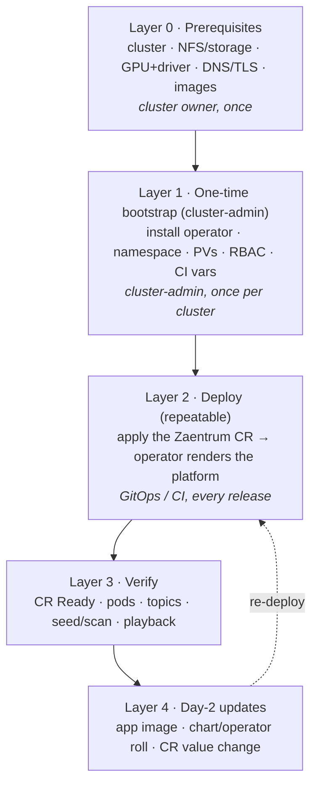

# Deploying & operating zaentrum

zaentrum is a neutral, self-hosted media platform — a catalog, an event-driven
media pipeline (scan → enrich → analyze → transcode → package), and clean web /
mobile / TV clients — for a library **you own and are entitled to stream**.

The whole platform (~16 services) ships as public container images at
`ghcr.io/zaentrum/<service>` and is **operator-managed**: the
[zaentrum-operator](./operator.md) renders everything from one canonical Helm
chart (`operator/platform/chart`, embedded in the operator image) driven by a
single `Zaentrum` custom resource. Chart values map 1:1 onto the CR spec.

## Pick your path

| You want to… | Start here |
|---|---|
| **Try it in one command** (a whole cluster in one container) | [Self-hosting → Appliance](./self-hosting.md#a-one-command-appliance) |
| **Run your own instance** on Kubernetes / k3s / Compose | [Self-hosting](./self-hosting.md) |
| **Understand / reference every `Zaentrum` CR field** | [Operator & CR reference](./operator.md) |
| **Reproduce the public reference demo** (OKD + GitLab CI GitOps) | [Reference demo](./reference-demo.md) |
| **Ship a change** to a running platform (day-2) | [Updating](./updating.md) |
| **Fix a broken deploy** | [Troubleshooting](./troubleshooting.md) |
| **Understand how it fits together** | [Architecture](./architecture.md) |

Start with [Prerequisites](./prerequisites.md) regardless of path.

## The deployment model — four layers by actor and cadence

Every deploy topology is the same four layers; only *who* runs each layer and
*how often* changes. Confusing these is the usual source of pain (e.g. trying to
create a cluster-scoped `PersistentVolume` from the CI service account).

- **Layer 0 — [Prerequisites](./prerequisites.md).** The cluster + external
  dependencies. The appliance needs almost none of it; a real cluster needs
  storage, (optionally) a GPU node, and DNS/TLS.
- **Layer 1 — one-time bootstrap.** The cluster-scoped, privileged bits that a
  deploy pipeline *cannot* do itself: install the operator (CRD + ClusterRoles),
  create the namespace + `PersistentVolume`s, grant RBAC, set CI credentials.
  See [Reference demo → bootstrap](./reference-demo.md#layer-1--one-time-cluster-admin-bootstrap).
- **Layer 2 — deploy.** Apply a `Zaentrum` CR; the operator reconciles the whole
  platform via server-side apply. This is the only step that repeats per release.
- **Layer 3 — verify.** `oc get zaentrum` → `Phase Ready`, then a smoke test.
- **Layer 4 — [updates](./updating.md).** Shipping a new app image, a chart
  change (needs an operator roll), or a CR value change.

## The three topologies

| Topology | What it is | Deploy path |
|---|---|---|
| **Appliance** | One `--privileged` container = a single-node k3s that auto-applies the platform. Zero-clone. | [self-hosting.md#a-one-command-appliance](./self-hosting.md#a-one-command-appliance) |
| **Self-host on k8s** | Install the operator, apply a CR (or `helm install` the chart). Also k3s / Compose profiles. | [self-hosting.md](./self-hosting.md) |
| **Reference demo** | The public demo at `zaentrum.demo.nalet.cloud` on OKD, deployed by GitLab CI. The worked example of a real GitOps deploy. | [reference-demo.md](./reference-demo.md) |

## The media pipeline is event-driven (Kafka)

Stage handoffs are Kafka events keyed by `item_id`
(`stube.catalog.item.{discovered,enriched,analyzed,transcoded}`); the DB
processing-step rows record *state* while events drive the *handoff*. A bundled
single-node KRaft broker carries it by default (`features.kafka`), or point at an
external cluster. If you want **topics to survive a broker restart**, back the
broker with a volume via `storage.kafkaPvc` (see the
[CR reference](./operator.md) and [Troubleshooting](./troubleshooting.md)).
