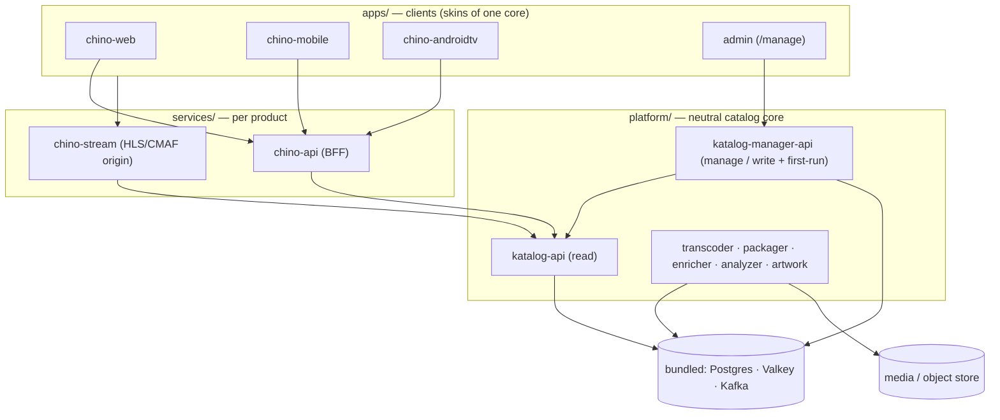
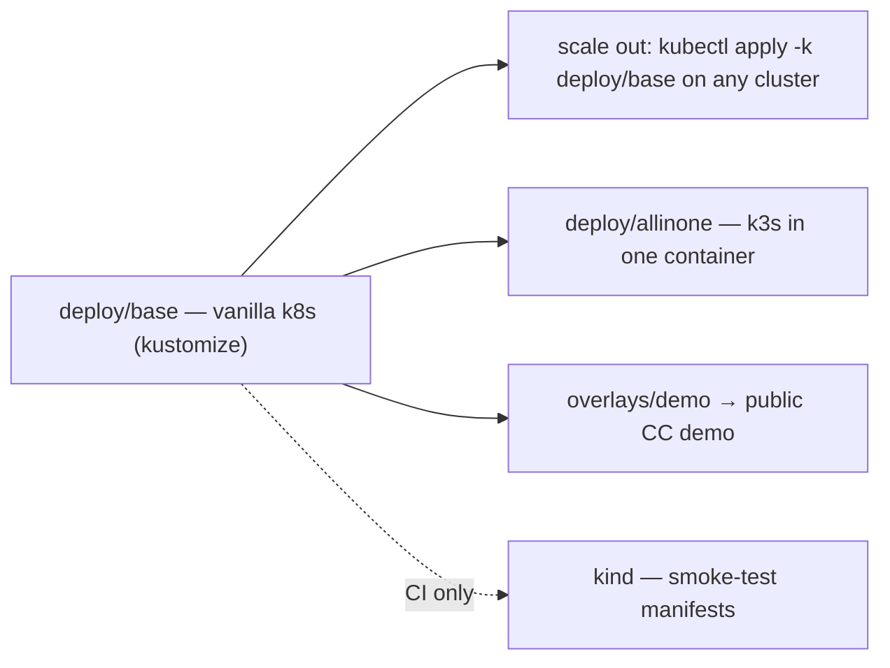

# Stube architecture

## What Stube is

A neutral, self-hostable media client + server for a library **you own and are entitled to
stream**. It is a catalog core + per-product streaming backends + clients. Stube is
content-neutral: you bring files you already have, and Stube catalogs them, processes them
(transcode/package), and streams them to its clients. It never acquires content.



## Front door and route map

One ingress/proxy fronts the whole product on port 80:

| Path | Backend | What it is |
|---|---|---|
| `/` | `chino-web` | the main app (static SPA) |
| `/manage` | admin UI (`apps/admin`) | the React launchpad (SPA, router basename `/manage`) |
| `/api` | `chino-api` | the product BFF |
| `/api/manage` | `katalog-manager-api` | the neutral management / write API |

**First-run:** `katalog-manager-api` exposes `GET /api/manage/setup/status`. While it
returns `configured: false`, the app sends every visitor to the first-run wizard at
`/manage/setup`. See the [config contract](#config-contract).

## Scope — the neutral line {#scope}

Stube ships **only** the neutral platform. The hard boundary: anything that knows *how
content was acquired* lives **outside this repo**, in a private deployment.

| In this repo (neutral) | Never in this repo (private to an operator) |
|---|---|
| clients, `chino-api`, `chino-stream` | any tool that fetches or downloads content |
| `katalog-api` (read), `katalog-manager-api` (manage/write) | any control plane that decides what to go and get |
| transcoder, packager, enricher, analyzer, artwork | anything that reaches out to indexers or trackers |

The catalog write path is the neutral `katalog-manager-api`: it registers and manages
library entries for files that are **already on disk**. How those files got there is not
Stube's concern and never will be.

This isn't cosmetic. A media client/server is distributable on app stores precisely
*because* it is content-neutral. Bundling acquisition would re-import the IP problem and is
against store and host policy.

## Relationship to the private nalet deployment

`github.com/zaentrum/stube` is the **canonical, public source of truth**. The operator's real
deployment (behind their own identity provider, with their own library) consumes this repo
and adds, *out of tree*:

- a platform-specific deploy overlay (ingress class, storage class, monitoring),
- real config (its own OIDC issuer, library path) — supplied as **data** via the first-run
  setup or env, **never code**.

So nothing operator-specific lives here. Config is data; the platform is neutral. Images
are published under `ghcr.io/zaentrum/stube/<service>` and OIDC is wired by discovery from the
issuer you configure.

## Config contract {#config-contract}

`katalog-manager-api` implements this; the admin UI consumes it. **Keep them identical.**

```
GET  /api/manage/setup/status
     -> { configured: boolean,
          version: string,
          checks: { database: bool, kafka: bool, library: bool } }

POST /api/manage/setup
     body { displayName, oidcIssuer, oidcClientId, libraryPath, streamSigningKey? }
     -> persists config (generates streamSigningKey if absent)
     -> { configured: true }

GET  /api/manage/config   -> current non-secret config
PUT  /api/manage/config   -> update
```

`streamSigningKey` is the shared secret minted by `chino-api` and verified by
`chino-stream`. If setup omits it, `katalog-manager-api` generates one so the two services
agree out of the box; a mismatch is the classic "artwork loads but playback returns 403"
symptom.

## Deploy model — one source, many targets

`deploy/` is the single source of truth. The **base** is vanilla Kubernetes (Deployment +
Service + **Ingress**) — no platform-specific objects.



- **All-in-one** (`deploy/allinone`) — a single privileged container that runs **k3s
  in-process** and applies the base. This is the `docker run … ghcr.io/zaentrum/stube:latest`
  experience: one image, one port, a complete server. **Postgres, Valkey, and Kafka are
  bundled** inside it, so there is nothing external to install.
- **Scale out** (`deploy/base`) — the same manifests on a real Kubernetes cluster via
  `kubectl apply -k deploy/base`. Bring your own Postgres/Valkey/Kafka or run the bundled
  ones; the manifests do not change.
- **Demo** (`overlays/demo`) — a public demo that serves Creative-Commons / public-domain
  content only (see [self-hosting.md](self-hosting.md#demo)). Unchanged by the all-in-one
  work.
- **kind** — used in CI to smoke-test the manifests, **not** as a runtime.
- GPU (NVENC) is **optional**: base defaults to software ffmpeg; a GPU overlay adds the
  device request.

## License {#license}

**Chosen: [MPL-2.0](../LICENSE).** The clients ship to mobile app stores, which constrained
the choice:

- **Strong copyleft (GPL/AGPL family)** — strong protection, but conflicts with mobile app
  store distribution terms, and the iOS client (KMP) is in scope.
- **MPL-2.0** — file-level copyleft, app-store compatible. Good middle ground.
- **Permissive (Apache-2.0 / MIT)** — zero friction, weakest protection.

**Decision: MPL-2.0** for the whole monorepo — protects the platform (file-level copyleft)
while keeping the clients store-distributable.

## Pre-public gates

Before the repo is flipped public on GitHub:

1. License chosen and applied — done (MPL-2.0).
2. **No operator specifics in tree** — neutral images (`ghcr.io/zaentrum/stube/<service>`),
   OIDC by discovery from a configured issuer, no hardcoded issuers/admin subjects/registry
   creds.
3. **Clean git history** — fresh initial commit, no imported private history. Keep it that
   way.
4. **Demo serves only distributable content** (see [self-hosting.md](self-hosting.md#demo)).
