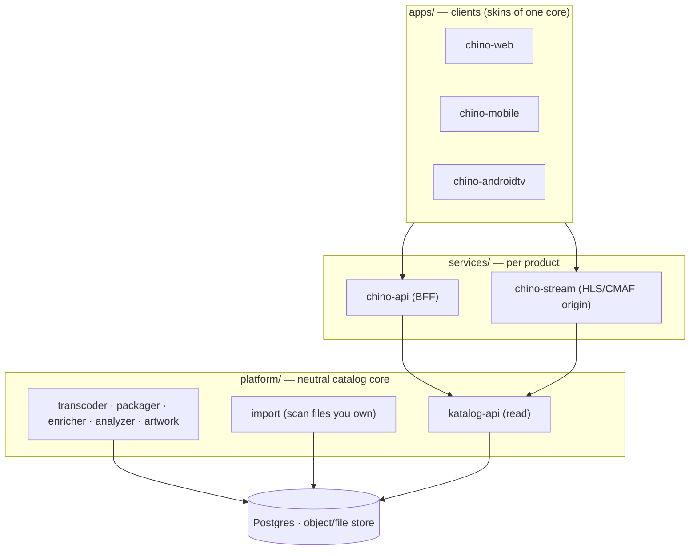
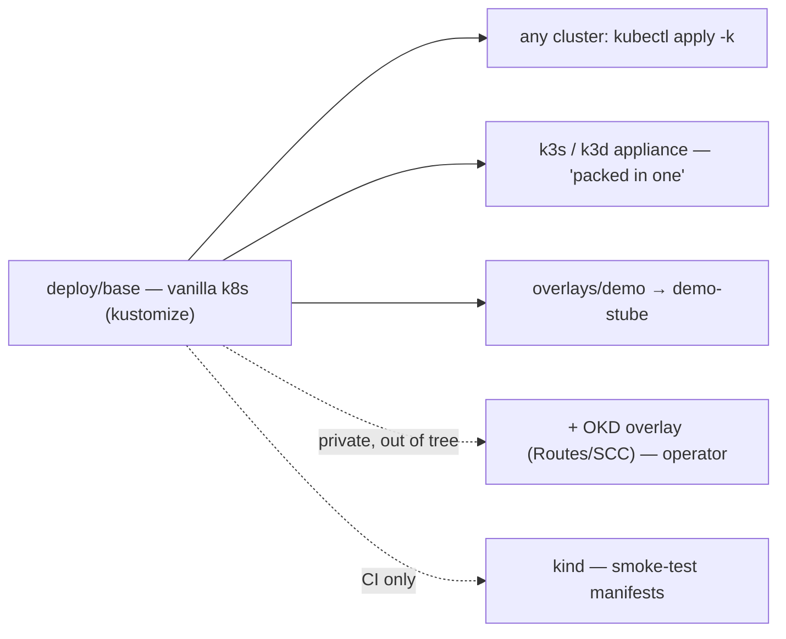

# Stube architecture

## What Stube is

A neutral, self-hostable media platform: a catalog core + per-product streaming
backends + clients. It is content-neutral — the same category as Jellyfin/Plex/Kodi.
You bring a library you own; Stube catalogs, processes (transcode/package), and streams
it to its clients.

## Scope — the neutral line {#scope}

Stube ships **only** the neutral platform. The hard boundary: anything that knows *how
content was acquired* lives **outside this repo**, in a private deployment.

| In this repo (neutral) | Never in this repo (private to an operator) |
|---|---|
| clients, `chino-api`, `chino-stream` | automated downloaders, indexers, the *arr stack |
| `katalog-api` (read), transcoder, packager, enricher, analyzer, artwork | acquisition control plane / "wanted items" automation |
| a neutral **import** path (scan files you already own) | anything that fetches copyrighted content |

This isn't cosmetic: a media client/server is allowed on app stores precisely *because*
it's content-neutral. Bundling acquisition would re-import the IP problem and is against
store and host policy.

## Relationship to the private nalet deployment

`github.com/nalet/stube` is the **canonical, public source of truth**. The operator's
real deployment (on OKD, behind Keycloak, fed by a private acquisition stack) consumes
this repo and adds, *out of tree*:

- the acquisition stack (separate private repos that **write into** the catalog),
- the OpenShift-specific deploy overlay (Routes, SCCs, ServiceMonitor, GrafanaDashboard,
  the internal image registry),
- real config (its own OIDC issuer, content library) — supplied as **env / `/api/config`,
  never code.

So nothing nalet-specific lives here. Config is data; the platform is neutral.

## Deploy model — one source, many targets

`deploy/` is the single source of truth. The **base** is vanilla Kubernetes (Deployment +
Service + **Ingress**) — no OpenShift `Route`, no `ServiceMonitor`/`GrafanaDashboard`.

- **Appliance** (`deploy/k3s`) — k3s/k3d single-node cluster, the literal all-in-one.
- **Compose** (`deploy/compose`) — lighter alternative for a NAS, same images.
- **kind** — used in CI to smoke-test the manifests, **not** as a runtime.
- GPU (NVENC) is **optional**: base defaults to software ffmpeg; a GPU overlay adds the
  device-plugin request. The single-box appliance also slims the processing event bus
  (Kafka → embeddable queue) — Kafka stays in the operator's platform deploy.

## License {#license}

**Open decision, required before going public.** The clients ship to app stores, which
constrains the choice:

- **GPL-2.0 / AGPL-3.0** — category norm (Jellyfin GPLv2; Immich AGPL). Strong copyleft,
  but **GPL is incompatible with the Apple App Store** terms, and the iOS client (KMP)
  is in scope.
- **MPL-2.0** — file-level copyleft, app-store compatible (used by Firefox). Good middle.
- **Apache-2.0 / MIT** — permissive, zero friction, weakest protection.

Recommendation: **MPL-2.0** for the whole monorepo (protects the platform, keeps the
clients store-distributable), or split AGPL-server / MPL-clients if you want stronger
server copyleft.

## Pre-public gates

Before the repo is flipped public on GitHub:

1. **License chosen** and applied.
2. **No nalet specifics in tree** — verified: neutral images, env-driven OIDC, no
   hardcoded issuer/admin subjects/registry creds (the migration de-nalets each file).
3. **Clean git history** — this repo starts from a fresh initial commit (no imported
   private history), so there is no historical secret to scrub. Keep it that way.
4. **Demo serves only distributable content** (see [self-hosting.md](self-hosting.md)).
